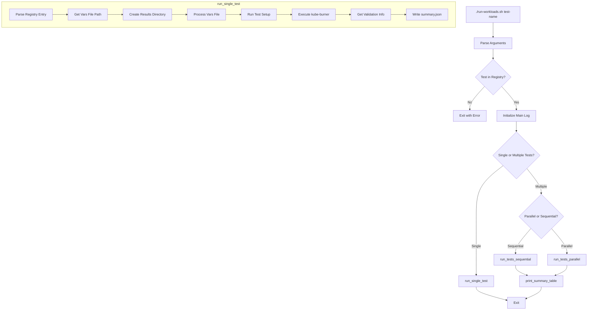

# CNV Scenarios Architecture

This document describes the internal architecture of the CNV test scenarios, focusing on `run-workloads.sh` and the validation scripts system. It's intended for contributors who want to understand or extend the codebase.

## Table of Contents

- [Overview](#overview)
- [run-workloads.sh](#run-workloadssh)
  - [Execution Flow](#execution-flow)
  - [Test Registry](#test-registry)
  - [Mode Handling](#mode-handling)
  - [Vars File Processing](#vars-file-processing)
  - [Test-Specific Setup Functions](#test-specific-setup-functions)
  - [Parallel Execution](#parallel-execution)
  - [Results Structure](#results-structure)
- [Validation Scripts Architecture](#validation-scripts-architecture)
  - [Two-Tier System](#two-tier-system)
  - [Shared Scripts](#shared-scripts-configscripts)
  - [Local Scripts](#local-scripts-scale-testing)
  - [How beforeCleanup Works](#how-beforecleanup-works)
- [Adding a New Scenario](#adding-a-new-scenario)

---

## Overview

The CNV scenarios test suite uses [kube-burner](https://kube-burner.github.io/kube-burner/) to orchestrate VM creation, lifecycle operations, and validation against OpenShift Virtualization (CNV). The `run-workloads.sh` script provides a unified interface for running any scenario with consistent behavior.

---

## run-workloads.sh

### Execution Flow



### Test Registry

The `TEST_REGISTRY` associative array maps test names to their configuration:

```bash
declare -A TEST_REGISTRY=(
    ["cpu-limits"]="resource-limits/cpu-limits:cpu-limits-test.yml:yml"
    # Format: "relative_dir:config_file:vars_extension"
)
```

Each entry contains three colon-separated fields:
1. **relative_dir** - Directory path relative to cnv-scenarios
2. **config_file** - The kube-burner config YAML file name
3. **vars_extension** - File extension for vars files (yml or yaml)

The `TEST_ORDER` array defines execution order for `--all`:

```bash
TEST_ORDER=(
    "cpu-limits"
    "memory-limits"
    # ... etc
)
```

### Mode Handling

Two modes are supported via `--mode`:

| Mode | Vars File | Purpose |
|------|-----------|---------|
| `full` (default) | `vars.yml` | Full-scale testing with production-like values |
| `sanity` | `vars-sanity.yml` | Quick validation with minimal resources |

The `get_vars_file()` function selects the appropriate file:

```bash
get_vars_file() {
    local test_dir="$1"
    local ext="$2"
    if [[ "$MODE" == "sanity" ]]; then
        echo "${test_dir}/vars-sanity.${ext}"
    else
        echo "${test_dir}/vars.${ext}"
    fi
}
```

### Vars File Processing

Before passing to kube-burner, vars files are processed with `sed`:

```bash
sed -e "s/TIMESTAMP/${unique_suffix}/g" \
    -e "s|^resultsPath:.*|resultsPath: \"${RESULTS_BASE}/${test_name}\"|" \
    -e "s|^runTimestamp:.*|runTimestamp: \"${run_timestamp}\"|" \
    "$vars_file" > "$temp_vars"
```

This:
1. Replaces `TIMESTAMP` placeholders with unique suffixes for namespace isolation
2. Updates `resultsPath` to the standardized location
3. Sets `runTimestamp` for consistent result organization

### Test-Specific Setup Functions

Some tests require pre-execution setup. The `run_setup()` dispatcher calls test-specific functions:

```bash
run_setup() {
    case "$test_name" in
        per-host-density)
            setup_per_host_density  # Auto-selects targetNode
            ;;
        nic-hotplug)
            setup_nic_hotplug       # Auto-detects baseInterface
            ;;
        *)
            return 0  # No special setup needed
            ;;
    esac
}
```

**setup_per_host_density:**
- Auto-selects first worker node if `targetNode` not specified
- Displays scale configuration (VMs per namespace, total VMs)

**setup_nic_hotplug:**
- Auto-detects available network interface via `detect-available-interface.sh`
- Reads `nicCount` from vars file based on mode

### Parallel Execution

When `--parallel` is used with multiple tests:

1. Each test runs in a subshell with output redirected to a temp log
2. Parent process tracks PIDs in `pid_to_test` array
3. After all complete, results are read from `summary.json` files
4. Temp logs are displayed and cleaned up

This approach handles the bash limitation where associative arrays don't propagate from subshells.

### Results Structure

```
/tmp/kube-burner-results/
├── vme-test-20241210-143052.log     # Main orchestration log
├── cpu-limits/
│   └── run-20241210-143052/
│       ├── kube-burner.log          # Full kube-burner output
│       ├── summary.json             # Test metadata and status
│       ├── vars-cpu-limits-full.yml # Processed vars file
│       └── iteration-1/
│           ├── vmiLatency.json
│           ├── pvcLatency.json
│           └── validation-*.json    # Validation reports
```

**summary.json format:**
```json
{
    "test": "cpu-limits",
    "mode": "full",
    "exit_code": 0,
    "results_path": "/tmp/kube-burner-results/cpu-limits/run-20241210-143052",
    "validation_status": "SUCCESS",
    "validation_files": ["..."],
    "duration_seconds": 342,
    "timestamp": "2024-12-10T14:35:34-05:00"
}
```

---

## Validation Scripts Architecture

### Two-Tier System

Validation scripts are organized in a two-tier system based on scenario requirements:

| Script | Location | Used By | Purpose |
|--------|----------|---------|---------|
| `check.sh` (global) | `config/scripts/` | 8 scenarios | Full validation suite with retry mechanism |
| `wrapper.sh` | `config/scripts/` | 8 scenarios | Dispatcher that invokes check.sh with logging |
| `check.sh` (local) | `scale-testing/*/config/scripts/` | 2 scenarios | Percentage-based sampling for scale tests |

### Shared Scripts (`config/scripts/`)

**check.sh**

The comprehensive validation script containing all standard validation functions plus helper utilities and retry mechanisms.

**Global Configuration:**
```bash
MAX_RETRIES=130      # Maximum validation attempts
MAX_SHORT_WAITS=12   # Number of short waits before switching to long
SHORT_WAIT=5         # Seconds between initial retries
LONG_WAIT=30         # Seconds between later retries
```

**Helper Functions:**

| Function | Purpose |
|----------|---------|
| `get_vms()` | Retrieve VMs by namespace and label selector |
| `remote_command()` | Execute SSH command using private key authentication |
| `remote_command_password()` | Execute SSH command using password (for CirrOS VMs via sshpass) |
| `retry_validation()` | Wrapper that retries validation functions with configurable backoff |
| `log_validation_start/checkpoint/end()` | Structured logging for JSON report generation |
| `save_validation_report()` | Generate JSON validation report to results directory |

**Validation Functions:**

| Function | Purpose | Parameters |
|----------|---------|------------|
| `check_vm_running` | Validates VMs are running + SSH accessible | label_key, label_value, namespace, private_key, vm_user |
| `check_vm_shutdown` | Validates VMs are stopped | label_key, label_value, namespace |
| `check_resize` | Validates PVC resize completed | label_key, label_value, namespace, expected_size, private_key, vm_user, results_dir |
| `check_cpu_limits` | Validates CPU cores via SSH (`nproc`) | label_key, label_value, namespace, expected_cores, private_key, vm_user, results_dir |
| `check_memory_limits` | Validates memory via SSH (`free -m`) with 15% tolerance | label_key, label_value, namespace, expected_memory, private_key, vm_user, results_dir |
| `check_disk_limits` | Validates disk count/size via SSH (`lsblk`) | label_key, label_value, namespace, disk_count, disk_size, private_key, vm_user, results_dir |
| `check_disk_hotplug` | Validates hot-plugged disks attached and mounted | label_key, label_value, namespace, disk_count, pvc_size, private_key, vm_user, validate_by_size, validate_from_os, results_dir |
| `check_nic_hotplug` | Validates NNCPs, NADs, and NIC count (5 phases) | label_key, label_value, namespace, nic_count, private_key, vm_user, validate_interfaces, results_dir |
| `check_large_disk` | Validates large disk visibility (4 phases) | label_key, label_value, namespace, disk_size, private_key, vm_user, results_dir |
| `check_high_memory` | Validates high memory allocation with tolerance | label_key, label_value, namespace, memory_size, private_key, vm_user, results_dir |
| `check_performance_metrics` | Validates CirrOS VMs (password-based SSH) | label_key, label_value, namespace, vm_password, vm_user, results_dir |

**Validation Flow Example (check_memory_limits):**
```
Phase 1/4: Discover VMs via label selector
Phase 2/4: Check VM spec memory configuration
Phase 3/4: SSH into guest, verify memory via `free -m` (15% tolerance)
Phase 4/4: Check stress-ng processes (if applicable)
```

All validation functions are wrapped by `retry_validation()` which:
1. Attempts validation up to `MAX_RETRIES` times
2. Uses short waits initially, switching to long waits after `MAX_SHORT_WAITS`
3. Preserves exit code for kube-burner beforeCleanup

**wrapper.sh**

Acts as a dispatcher that:
1. Resolves the path to `check.sh` (handles different execution contexts)
2. Creates the results directory
3. Executes validation with logging to both stdout and file
4. Preserves the exit code from validation

**Other shared scripts:**
- `cleanup-nncp.sh` - Cleans up NodeNetworkConfigurationPolicies after nic-hotplug tests
- `detect-available-interface.sh` - Auto-detects an unused network interface for nic-hotplug

### Local Scripts (scale-testing)

Scale-testing scenarios have their own `check.sh` because they require **percentage-based sampling** - validating 25% of 450 VMs is different from validating all 1-10 VMs in other scenarios.

**per-host-density/config/scripts/check.sh:**

| Function | Purpose |
|----------|---------|
| `check_vm_running` | Validates VMs are running + SSH validation on N% sample |
| `check_vm_shutdown` | Validates VMs are stopped |

**virt-capacity-benchmark/config/scripts/check.sh:**

Same as per-host-density plus:

| Function | Purpose |
|----------|---------|
| `check_resize` | Validates PVC resize completed via `lsblk` |

**Key features of scale-testing check.sh:**
- Configurable `percentage_to_validate` (default 25%)
- Configurable `max_ssh_retries` with 15s intervals
- Random VM selection for sampling
- Detailed JSON reports with timing metrics
- Node distribution reporting

> **Note:** The global `config/scripts/check.sh` also contains `check_vm_running`, `check_vm_shutdown`, and `check_resize` functions. The local scale-testing copies exist for percentage-based sampling logic specific to high-scale scenarios. Future work may consolidate these (see ISSUES.md).

### How beforeCleanup Works

kube-burner's `beforeCleanup` hook runs a script after job objects are created but before cleanup:

```yaml
# In scenario config file (e.g., cpu-limits-test.yml)
jobs:
- name: cpu-limits-test
  beforeCleanup: "../../config/scripts/wrapper.sh check_cpu_limits {{ $jobCounterLabelKey }} {{ $jobCounterLabelValue }} {{ $nsName }} {{ .cpuCores | default 1 }} {{ .privateKey }} {{ .vmUser }} {{ .resultsPath }}/{{ .runTimestamp }}/iteration-{{ .counter }}"
```

**Path resolution:**
- Paths are relative to the scenario's config file location
- `../../config/scripts/wrapper.sh` goes up to cnv-scenarios, then into config/scripts
- Scale-testing uses `config/scripts/check.sh` (relative to their own directory)

**Parameter templating:**
- Go template syntax `{{ .varName }}` is processed by kube-burner
- Variables come from the vars file passed via `--user-data`

---

## Adding a New Scenario

### Step 1: Create Directory Structure

```
cnv-scenarios/
└── <category>/
    └── <scenario-name>/
        ├── <scenario-name>-test.yml    # kube-burner config
        ├── vars.yml                     # Full mode variables
        ├── vars-sanity.yml              # Sanity mode variables
        ├── vm-<scenario>-template.yml   # VM template (if needed)
        └── templates/
            └── secret_ssh_public.yml    # SSH secret template
```

### Step 2: Register in run-workloads.sh

Add to `TEST_REGISTRY`:
```bash
["my-scenario"]="<category>/<scenario-name>:<config-file>.yml:yml"
```

Add to `TEST_ORDER` in desired position.

### Step 3: Create Config File

Use existing scenarios as templates. Key sections:
- `global.measurements` - Enable vmiLatency, pvcLatency
- `metricsEndpoints` - Local indexer + optional Elasticsearch
- `jobs` - Define creation, operations, and validation

### Step 4: Add Validation (if needed)

**For standard validation:**
Add function to `config/scripts/check.sh` and call via `wrapper.sh` in beforeCleanup.

**For scale-testing validation:**
Create local `config/scripts/check.sh` with percentage-based sampling.

### Step 5: Add Setup Function (if needed)

If your scenario needs pre-execution setup (auto-detection, validation):

```bash
setup_my_scenario() {
    # Auto-detect or validate configuration
    log ""
    log "My Scenario Configuration:"
    log "  param1=${param1:-default}"
    log ""
    return 0
}
```

Add to `run_setup()` dispatcher:
```bash
my-scenario)
    setup_my_scenario
    ;;
```

---

